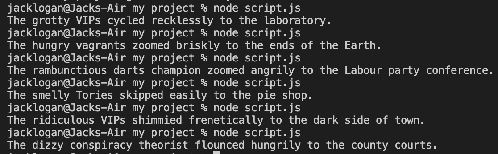

# Mixed Messages 

## General Info
A script to generate a randomized (and hopefully entertaining!) message. Based on the Codecademy project of the same name. 

-----------------------

## Sample output

Some example messages:

---------------

## Technologies 
The project has been created with:

- Javascript 
- Node.js (14.18.0)

-------------

## Setup

Install locally and run with `node script.js` via the command line. Happy coding! 👩‍💻👨‍💻

